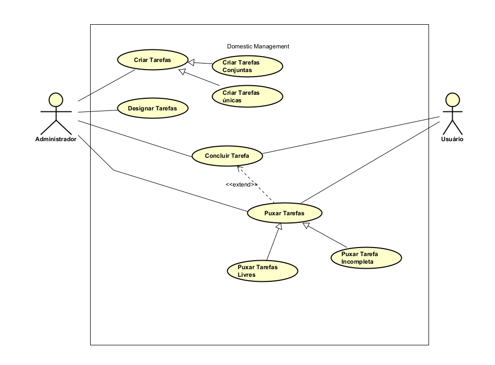
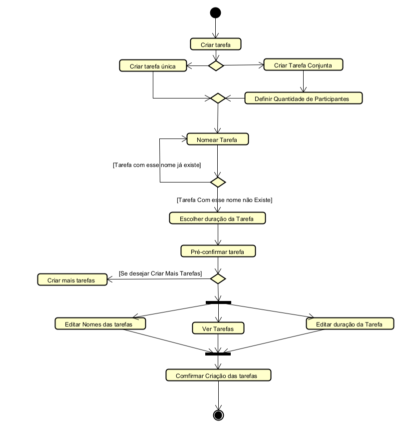
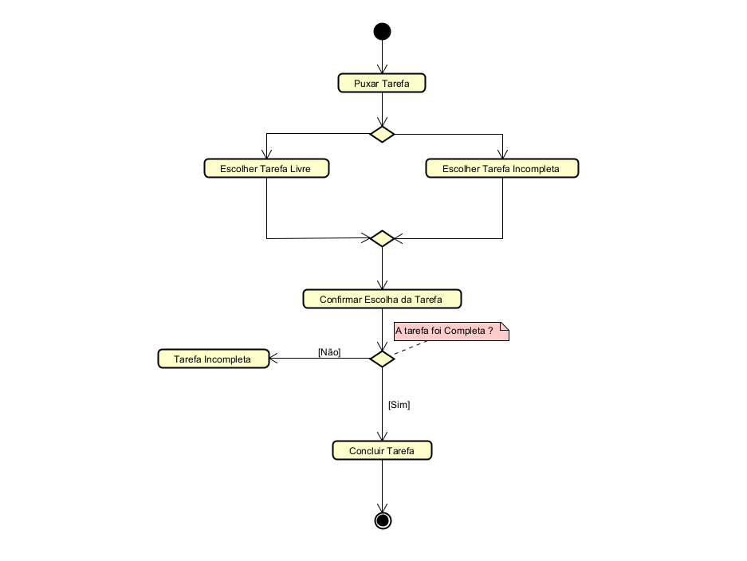

# Escopo do Sistema
A Domestic Management é uma aplicação focada em simplificar e centralizar a gestão de atividades e recursos domésticos. O escopo inclui um painel inicial personalizado que oferece uma visão geral do dia com tarefas e lembretes. O controle de inventário é utilizado para registrar alimentos, utensílios e produtos essenciais. A gestão financeira é integrada, permitindo o acompanhamento de despesas mensais e o compartilhamento de custos. A ideia é manter o controle dos gastos e dos produtos domésticos, em uma interface simples, e que possibilite visão para uma vida doméstica mais organizada e inteligente.

# Membros
- Danilo Siervi de Paula
- Iury Silva
- Mateus Azevedo Ferreira
- Matheus Moreira Vidal
- Nathan Almeida Rezende

# Tecnologias
- HTML, CSS e JavaScript
- Framework SAP UI5

# Backlog do Produto
#### **Gerenciamento de Tarefas**  
1. Como admin, eu gostaria de criar tarefas para organizar as responsabilidades da casa.  
2. Como admin, eu gostaria de designar tarefas para moradores específicos.  
3. Como usuário, eu gostaria de puxar tarefas livres para contribuir com a organização da casa.  
4. Como usuário, eu gostaria de postergar a tarefa recebida para ajustá-la à minha disponibilidade.  
5. Como usuário, eu gostaria de marcar como concluída uma tarefa para indicar que foi realizada.  
6. Como admin, eu gostaria de poder pontuar a realização das tarefas para incentivar a colaboração.  
7. Como admin, eu gostaria de comentar tarefas já finalizadas para dar feedback sobre a execução.  
8. Como admin, eu gostaria de reabrir tarefas para corrigir ou refazer algo que não foi bem executado.  
9. Como admin, eu gostaria de mandar notificações de aviso de tarefa atrasada para lembrar os responsáveis.  

#### **Gestão de Moradores e Administração da Casa**  
10. Como admin, eu gostaria de inserir um novo morador para manter a lista atualizada.  
11. Como admin, eu gostaria de remover um morador para refletir mudanças na residência.  

#### **Controle Financeiro**  
12. Como admin, eu gostaria de gerar a planilha de gastos mensais para cada morador.  
13. Como usuário, eu gostaria de visualizar a planilha de gastos mensais para acompanhar minhas despesas.  
14. Como usuário, eu gostaria de inserir uma nova despesa no registro para manter o controle financeiro.  
15. Como usuário, eu gostaria de editar uma despesa que foi inserida, para fins de correção.  
16. Como usuário, eu gostaria de inserir uma nova renda no registro para equilibrar as finanças.  
17. Como usuário, eu gostaria de editar uma renda que foi inserida, para fins de correção.  
18. Como usuário, eu gostaria de ver as minhas despesas ao longo da semana para ter um melhor planejamento.  
19. Como usuário, eu gostaria de anexar um comprovante de compra a ser ressarcido para justificar a despesa.  
20. Como usuário, eu gostaria de anexar um comprovante de contas pagas para manter o controle financeiro.  
21. Como admin, eu gostaria de visualizar o saldo da caixinha da casa para saber quanto dinheiro está disponível.  

#### **Lista de Compras e Manutenção da Casa**  
22. Como admin, eu gostaria de listar os produtos a serem comprados para manter o estoque organizado.  
23. Como usuário, eu gostaria de notificar sobre um problema na casa para que ele seja resolvido rapidamente.  

#### **Comunicação e Notificações**  
24. Como admin, eu gostaria de notificar sobre avisos referentes à casa para manter todos informados.  

#### **Uso de Áreas Comuns**  
25. Como usuário, eu gostaria de agendar o uso da lavanderia para evitar conflitos de horário.  

#### **Autenticação e Acesso**  
26. Como usuário, eu gostaria de criar uma conta na aplicação para acessar os serviços da casa.  
27. Como usuário, eu gostaria de fazer login em minha conta para gerenciar minhas informações.  

#### **Registro de Tarefas e Pendências**  
28. Como usuário, eu gostaria de criar um novo registro doméstico para acompanhar as atividades da casa.  
29. Como usuário, eu gostaria de adicionar novas tarefas domésticas, como comprar produtos ou resolver pendências.  

# **Backlog da Sprint**  

## **Gerenciamento de Tarefas**  

### **História #1: Como admin, eu gostaria de criar tarefas para organizar as responsabilidades da casa.**  
#### **Tarefas e responsáveis:**  
✅ Instalar banco de dados e criar primeiras tabelas **[Nathan]**  
✅ Instalar o node.js e o sap UI5 **[Iury]**  
✅ Criar modelo de dados para tarefas no banco de dados **[Mateus]**  
✅ Implementar API para criação de tarefas **[Matheus]**  
✅ Criar interface para criação de tarefas **[Iury]**  

### **História #2: Como admin, eu gostaria de designar tarefas para moradores específicos.**  
#### **Tarefas e responsáveis:**  
✅ Adicionar campo de responsável na tabela de tarefas **[Danilo]**  
✅ Implementar lógica de atribuição no backend **[Nathan]**  
✅ Ajustar interface para permitir a designação de tarefas **[Matheus]**  

### **História #3: Como usuário, eu gostaria de puxar tarefas livres para contribuir com a organização da casa.**  
#### **Tarefas e responsáveis:**  
✅ Criar endpoint para listar tarefas disponíveis **[Mateus]**  
✅ Implementar botão para puxar tarefa no frontend **[Danilo]**  

### **História #4: Como usuário, eu gostaria de puxar tarefas incompletas de outros usuarios para contribuir com a organização da casa.** 
#### **Tarefas e responsáveis:**

### **História #5: Como admin, eu gostaria de criar tarefas em conjunto para organizar as responsabilidades da casa.**
#### **Tarefas e responsáveis:**

# **Protótipo (Figma)**
Link: <https://www.figma.com/design/wdhPV5poco9GLevSWjOuNb/Domestic-Manager-Prototype?t=hgdihqDdCtlQvtqy-1>

# **Diagramas UML**

## **Diagrama UML (Casos de uso)** 

## **Diagrama UML (Atividades)**

### **Diagrama de Atividades (Criar Tarefas)** 

### **Diagrama de Atividades (Puxar Tarefas)**

### **Diagrama de Atividades (Designar Tarefa)**

## **Diagrama UML (Classes)** 

